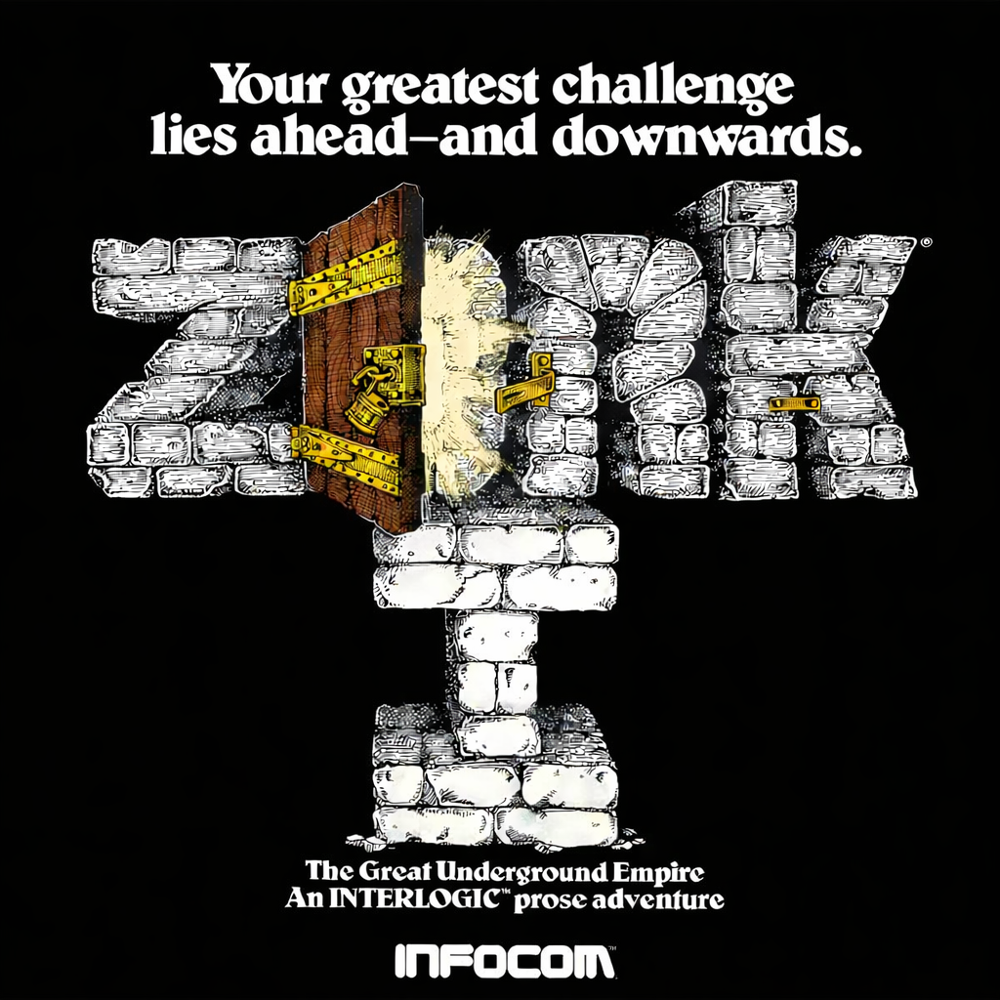

# Team Resurgent Presents, ZorkDotNet

A .NET port of [Zork](https://en.wikipedia.org/wiki/Zork), the classic interactive fiction game. ZorkDotNet runs on Windows, Linux, and Mac.

*You are standing in an open field west of a white house.* The Great Underground Empire, with its treasures, grues, and twisty little passages, rebuilt in .NET. One executable, any platform. No pictures. Just words and your imagination.

## Original source

The game originates from the 1977 version of Zork created at MIT by Tim Anderson, Marc Blank, Bruce Daniels, and Dave Lebling. The **1977 source code** is preserved and published by MIT’s Department of Distinctive Collections (DDC):

- **[MITDDC/zork](https://github.com/MITDDC/zork)** Source code for the 1977 version of Zork (MDL, from the [Tapes of Tech Square (ToTS)](https://archivesspace.mit.edu/repositories/2/archival_objects/347748) collection).

This repository is an independent reimplementation in C#/.NET and is not affiliated with MIT or Infocom.

## Shoutouts

Thanks to **[MrMario2011](https://www.youtube.com/@MrMario2011)** for nagging for a port. A version for Xbox Original is coming soon.

Greetz to the following scene people, in no particular order: Milenko, Iriez, Mattie, ODB718, ILTB, HoZy, IceKiller, Rowdy360, Lantus, Kl0wn, nghtshd, Redline99, The_Mad_M, Und3ad, HermesConrad, Rocky5, xbox7887, tuxuser, Masonly, manderson, InsaneNutter, IDC, Fyb3roptik, Bucko, Aut0botKilla, headph0ne, Xer0 449, hazardous774, rusjr1908, Octal450, Gunz4Hire, Dai, bluemeanie23, T3, ToniHC, Emaxx, Incursion64, empyreal96, Fredr1kh, Natetronn, braxtron.